# 🎛️ NCC Digital Command & Management Platform (NCC-ERP)
### And God's Eye Network Intrusion Detection Engine (L1)

[](#)
[](#)
[](#)
[](#)
[](#)
[](#)
[](#)
[](#)
[](#)
[](#)
[](#)
[](#)
[](#)

---

## 📖 Workspace Portfolio Overview

This repository contains a unified, multi-module enterprise workspace addressing two critical domains:
1. **NCC Digital Command & Management Platform (NCC-ERP)**: A full-stack web (React/Next.js) and Android (Flutter) application that digitizes, automates, and streamlines the operations, academic curriculum, rank hierarchy, and attendance systems of a university NCC (National Cadet Corps) unit.
2. **God's Eye L1 Network Security Engine**: An advanced, AI-powered network threat intrusion detection system driven by an XGBoost supervised pipeline, capable of scanning live SIEM traffic, performing vectorized feature math, computing dynamic trust scores, and triggering automated SOAR playbooks.

---

## 🏢 Module 1: NCC Digital Command & Management Platform

The **NCC Digital Command & Management Platform** replaces fragmented, manual, and unreliable communication channels (such as paper registers, verbal announcements, and chaotic WhatsApp groups) with a single, secure, role-aware, and real-time digital ecosystem.

### 🎯 Key Performance Indicators (KPIs)
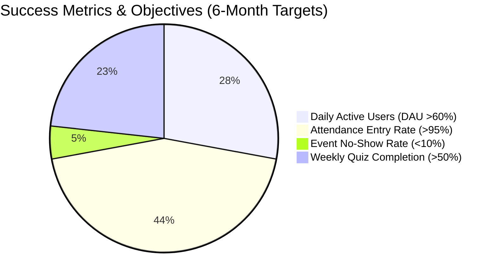

### 👤 Stakeholders & Role Matrix

The platform implements a strict role-based permission hierarchy, ensuring separation of duties and secure data access:

| Feature / Action | Cadet | Senior Under Officer (SUO) | Associate NCC Officer (ANO) | System Admin |
| :--- | :---: | :---: | :---: | :---: |
| **View Own Attendance** | 🟢 Yes | 🟢 Yes | 🟢 Yes | 🟢 Yes |
| **View All Cadet Attendance** | 🔴 No | 🟡 Own Company Only | 🟢 Yes | 🟢 Yes |
| **Mark Attendance** | 🔴 No | 🟡 Own Company Only | 🟢 Yes | 🔴 No |
| **Dispute Own Attendance** | 🟢 Yes | 🟢 Yes | 🔴 No | 🔴 No |
| **Resolve Attendance Dispute** | 🔴 No | 🔴 No | 🟢 Yes | 🔴 No |
| **Upload Study Resources** | 🔴 No | 🔴 No | 🟢 Yes | 🔴 No |
| **Create / Edit Events** | 🔴 No | 🔴 No | 🟢 Yes | 🔴 No |
| **Post Blog / Achievement** | 🟡 Pending Approval | 🟡 Pending Approval | 🟢 Auto-Approved | 🔴 No |
| **Approve Blog Posts** | 🔴 No | 🔴 No | 🟢 Yes | 🔴 No |
| **Submit Anonymous Feedback** | 🟢 Yes | 🟢 Yes | 🔴 No | 🔴 No |
| **Read Feedback & Respond** | 🔴 No | 🔴 No | 🟢 Yes | 🔴 No |
| **Manage User Accounts** | 🔴 No | 🔴 No | 🔴 No | 🟢 Yes |
| **View Audit Logs** | 🔴 No | 🔴 No | 🔴 No | 🟢 Yes |

---

### 🏗️ System Architecture

The platform uses a modern **Backend-as-a-Service (BaaS)** model powered by Supabase. A single Supabase instance exposes REST and real-time WebSocket APIs, consumed by both the Next.js web application and the Flutter mobile app.

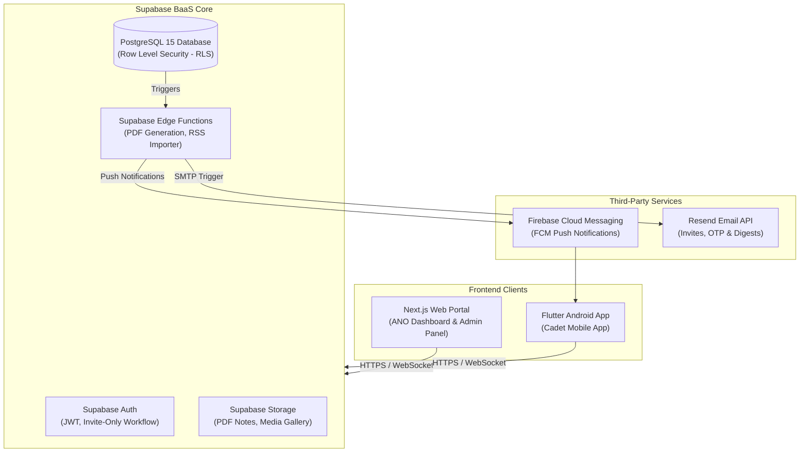


### 🛡️ Core Security Architecture & True Anonymity Flow

The platform utilizes **SHA-256 hashing with a dynamic daily salt** to maintain 100% feedback anonymity for cadets while preventing spam. 

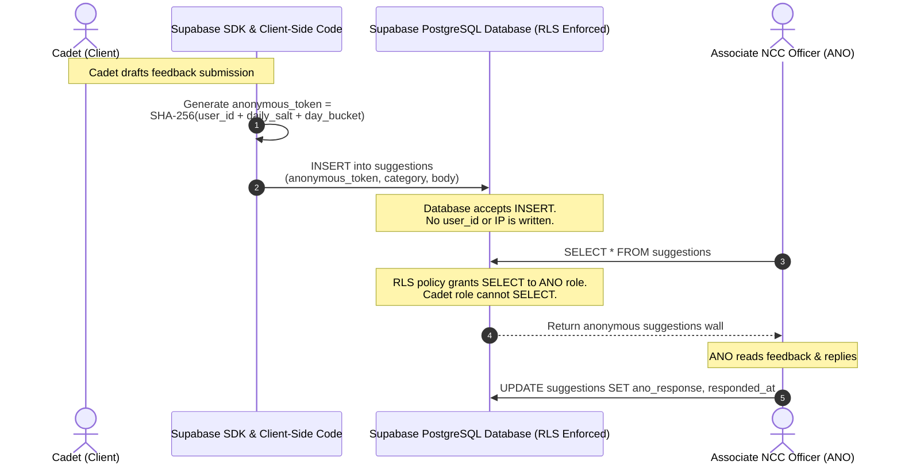

---

### 📅 Implementation Roadmap

The deployment of the NCC-ERP platform follows a highly structured, phased release pipeline to ensure stable onboarding:

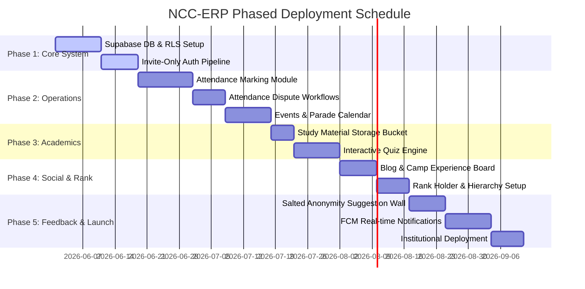

---

### 📷 Platform Interface Showcase

Below are screenshots of the fully wired NCC-ERP digital portal interfaces, showcasing the clean UI and dynamic data grids:

| **Officer Command Dashboard** | **Cadet Onboarding & Login** |
| :---: | :---: |
| 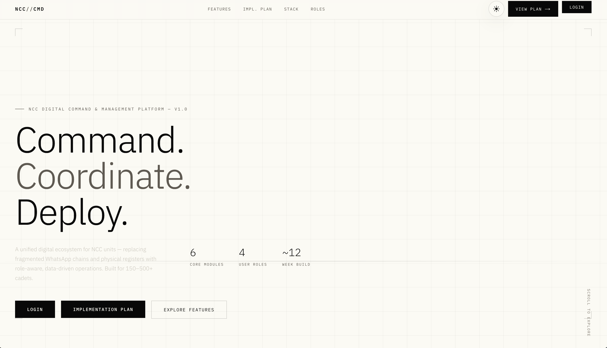 | 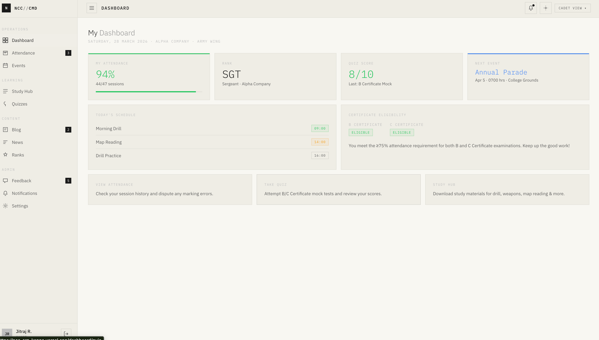 |
| **Attendance Marking & Drill Sessions** | **Parade & Camp Event Calendar** |
| 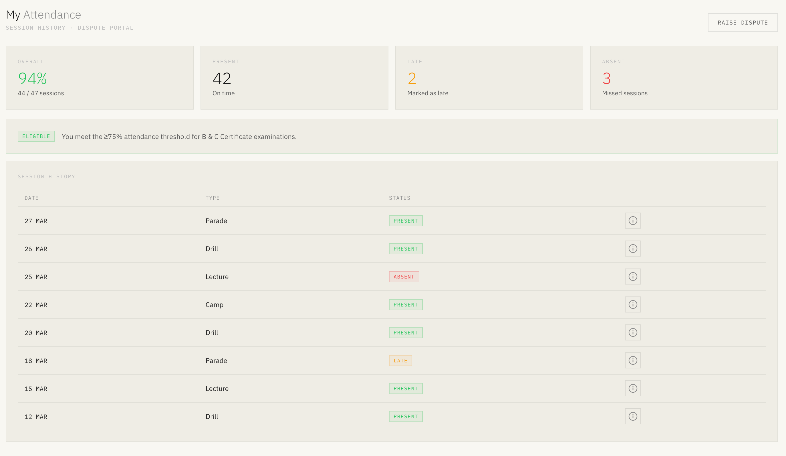 | 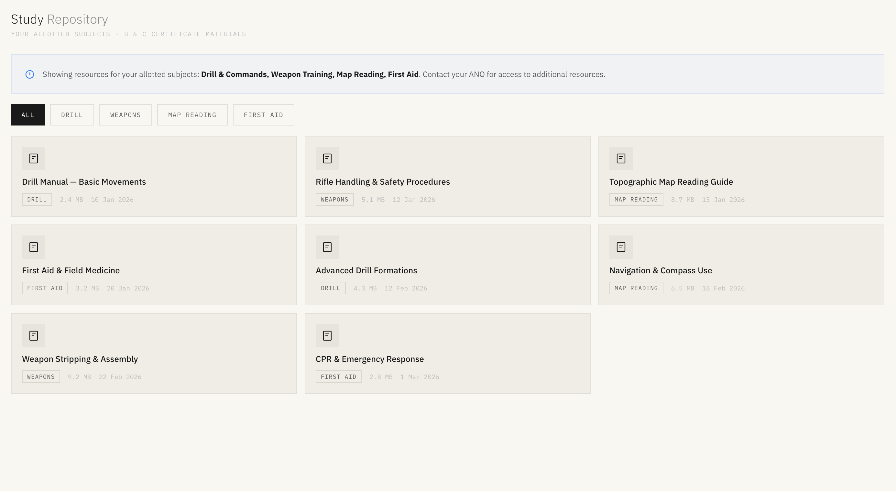 |
| **Study & B/C Certificate Materials** | **Salted Anonymous Suggestion Wall** |
| 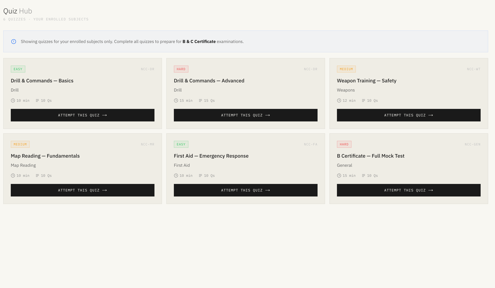 | 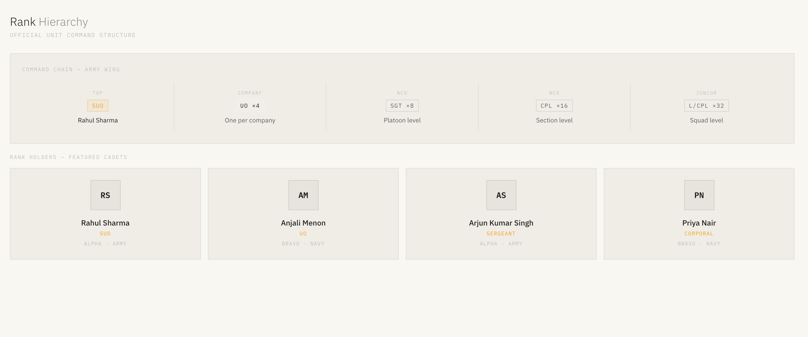 |
| **Rank & Hierarchy Management** | **Interactive Quiz Engine** |
| 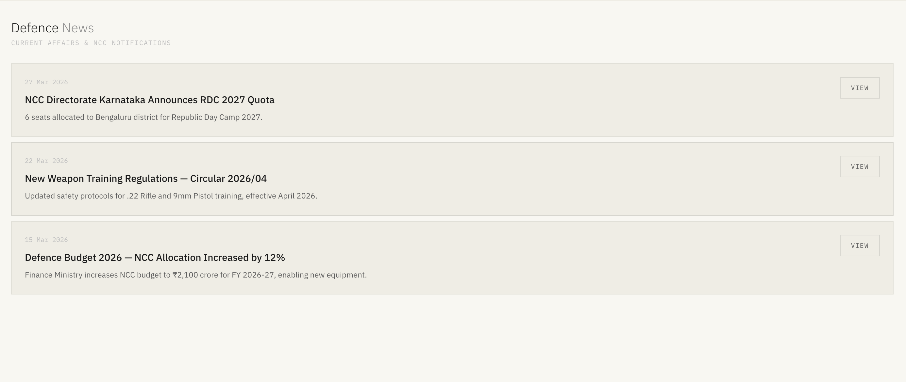 | 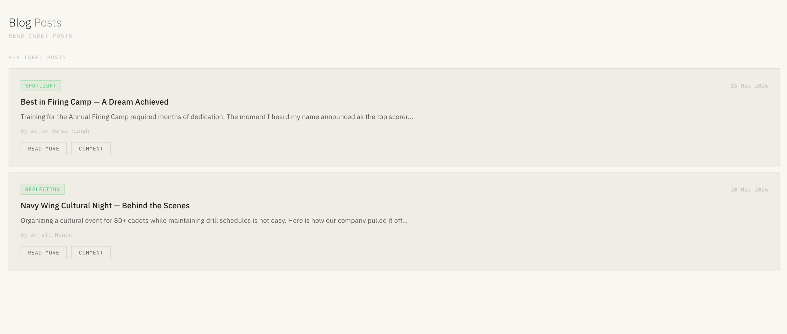 |

---

## 👁️ Module 2: God's Eye Layer 1 Network Intrusion Detection Engine

**God's Eye (L1)** is a high-performance network security engine designed to detect intrusion signatures, malicious beaconing, and automated attacks by scanning network flow features. It leverages a supervised **XGBoost Classifier** combined with robust scaling and physical feature engineering to classify network traffic and trigger SOAR playbooks.

### ⚙️ Machine Learning Pipeline

```mermaid
graph LR
    Raw["Raw Network Traffic Flow<br>(14 Canonical Features)"]
    Features["Vectorized Feature Engineering<br>(Interaction Physics Math)"]
    Scaler["Robust Scaler Transformation<br>(Artifact-aligned)"]
    XGB["XGBoost Classifier Model<br>(Isotonic calibrated output)"]
    Threshold{"Optimal Decision Threshold<br>(Training Calibrated)"}
    SOAR["Automated SOAR Action Trigger<br>(Trust Band Assignment)"]

    Raw --> Features
    Features --> Scaler
    Scaler --> XGB
    XGB --> Threshold
    Threshold -->|>= Threshold (Attack)| SOAR
    Threshold -->|< Threshold (Benign)| SOAR
```

### 🧠 Vectorized Feature Engineering (Interaction Physics)

The engine enhances raw network logs by applying mathematical interaction formulas in real-time, mapping physical characteristics:
- **Rate-Traffic Asymmetry Interaction**: `conn_rate * traffic_asymmetry`
- **Flag-Rate Anomaly Interaction**: `tcp_flag_anomaly * conn_rate`
- **Beaconing-Volume Ratio**: `beaconing_score * bytes_ratio`
- **Non-Linear Log Scaling**: Computes `log1p` of `conn_rate`, `iat_mean`, and `packet_size_var` to stabilize highly skewed traffic distributions.
- **Entropy Variance Ratio**: Computes `payload_entropy / max(packet_size_var, 1e-6)` to capture cryptographic payloads in low-variance streams.

### 📊 SOAR Trust Band & Threat Actions

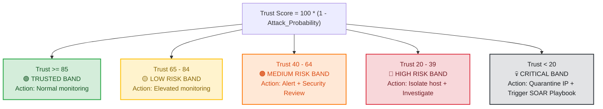

---

## 📁 Repository Structure

```text
NCC-ERP/
├── ncc-web/                      # Next.js 14 Web Portal
│   ├── src/
│   │   ├── app/                  # App Router Routes & Layouts
│   │   │   ├── (auth)/           # Authentication screens
│   │   │   └── dashboard/        # Officer, Cadet & Admin dashboard pages
│   │   ├── components/           # Shared shadcn/ui React components
│   │   ├── hooks/                # Custom React Query & Zustand hooks
│   │   └── lib/                  # Supabase client & utility helpers
│   ├── package.json
│   ├── tsconfig.json
│   └── tailwind.config.ts
│
├── NCC_PRD_v1_0.md               # Product Requirements Document (PRD)
├── NCC_Frontend_Spec.md          # Frontend Layout & Component Specification
├── ncc-dashboard.html            # Core Frontend Prototype mockup
├── FIxxes.md                     # Auditing log & UI event wire mappings
│
├── test_inference.py             # God's Eye L1 inference demonstration script
├── comprehensive_l1_test.py      # God's Eye attack chain SIEM simulation script
└── README.md                     # Repository documentation (This file)
```

---

## 🚀 Quick Start Guide

### 💻 Deploying the NCC-ERP Web Portal

#### 1. Prerequisites
Ensure you have **Node.js 18+** installed.

#### 2. Install Dependencies
Navigate into the web directory and install all required packages:
```bash
cd ncc-web
npm install
```

#### 3. Configure Environment Variables
Create a `.env.local` file in the `ncc-web/` directory:
```env
NEXT_PUBLIC_SUPABASE_URL=https://<your-project-id>.supabase.co
NEXT_PUBLIC_SUPABASE_ANON_KEY=<your-supabase-anon-key>
```

#### 4. Launch the Development Server
```bash
npm run dev
```
Open [http://localhost:3000](http://localhost:3000) in your browser.

---

### 🛡️ Running God's Eye L1 Security Engine

#### 1. Prerequisites
Ensure you have Python 3.8+ installed along with the required libraries.

#### 2. Install Dependencies
```bash
pip install numpy pandas xgboost joblib scikit-learn
```

#### 3. Load Model Artifacts
Before running inference, verify that you have downloaded the required XGBoost pipeline artifacts from the Kaggle training directory into `/kaggle/working/models` (or update the models directory parameter):
- `L1_xgboost.joblib` (Classifier model)
- `L1_scaler.joblib` (RobustScaler artifact)
- `L1_feature_names.joblib` (Feature list)
- `L1_threshold.json` (Calibrated probability threshold)

#### 4. Run the SIEM Simulation Test
Run the comprehensive attack chain simulation to see how the engine processes mock traffic:
```bash
python comprehensive_l1_test.py
```

---

## 🧪 Testing Methodology

The workspace employs a multi-tiered testing strategy ensuring code quality, security compliance, and robust reliability:

1. **Unit Tests (Jest & Flutter Test)**:
   - Covers core business logic including cadet attendance percentage computation, eligibility thresholds, and cryptographic token generation.
2. **Integration Tests (Supabase Local Emulator & Jest)**:
   - Validates Row Level Security (RLS) policies, database triggers, and Supabase Edge Functions.
3. **End-to-End Tests (Playwright & Flutter integration_test)**:
   - Simulates complete user journeys: Cadet disputes attendance, ANO approves a blog, and Admin performs a bulk CSV import.
4. **Load Testing (k6)**:
   - Validates that the Supabase backend can handle peak loads (e.g., 300+ cadets marking attendance within a 30-second window at the end of a parade).
5. **Security Audits (OWASP ZAP)**:
   - Regular vulnerability scans targeting Auth bypass, XSS, and SQL injections.

---

## ⚖️ Compliance & Governance
- **Data Protection**: Designed in strict compliance with the **Digital Personal Data Protection (DPDP) Act 2023** (India). No personal identifiers are logged in audit tables, and cadet records are archived or anonymized upon graduation.
- **Audit Trails**: Every write, rank promotion, or attendance override triggered by an ANO or Admin writes an immutable record to the `audit_logs` table.
